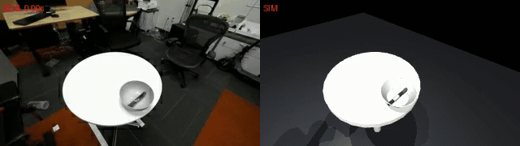
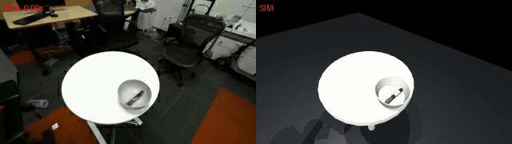

# droid2sim

An auditable reconstruction of **one real DROID episode in MuJoCo**:
“Take the pen out of the bowl and place it on the table.”

The pipeline uses the official Menagerie **Franka Panda + Robotiq 2F-85**, three real camera streams, and **181 unchanged joint/gripper samples**. The selected episode's raw release is unavailable, so cameras and object geometry are estimated from the RLDS images.

**Current result:** iteration 2 completes the task in the simulation and the programmatic check. Contact physics remain sensitive: the retained replay has up to **4.23 mm penetration**, and four other scene variants fail. This is a qualitative reconstruction, not a validated recovery of real-world physics.

## Retained replay

Real exterior camera 1 on the left, simulation on the right. GIFs show the complete episode at its original playback speed, reduced to 10 fps for display.


[Full comparison video](artifacts/iteration2/side_by_side.mp4) · [Simulation video](artifacts/iteration2/sim_ext1.mp4) · [42-second pipeline explainer](pipeline_explainer.mp4)

## Failed attempts

Failures are part of the result and remain available, with their original scene parameters and diagnostics.

| Iteration | Result | Comparison / simulation |
|---|---|---|
| 1 | Marker intersects the bowl interior and is not lifted | [Comparison](artifacts/iteration1/side_by_side.mp4) · [Sim](artifacts/iteration1/sim_ext1.mp4) |
| 3 | Stiffer contacts reduce penetration but lose the grasp | [Comparison](artifacts/iteration3/side_by_side.mp4) · [Sim](artifacts/iteration3/sim_ext1.mp4) |
| 4 | Shifted object placement still misses the grasp | [Comparison](artifacts/iteration4/side_by_side.mp4) · [Sim](artifacts/iteration4/sim_ext1.mp4) |
| 5 | Stiffer marker–bowl contacts still fail to capture the marker | [Comparison](artifacts/iteration5/side_by_side.mp4) · [Sim](artifacts/iteration5/sim_ext1.mp4) |

<details>
<summary>Watch all four failed simulations as GIFs</summary>

**Iteration 1**



**Iteration 3**



**Iteration 4**


**Iteration 5**


</details>

## Run

Python 3.12 was used for the experiment. Run commands from the repository root.

```sh
uv venv --python 3.12 .venv
uv pip install --python .venv/bin/python -r requirements.lock.txt

# Fresh clone only: fetch the sample and the two required robot models.
.venv/bin/python -m droid2sim download sample
.venv/bin/python -m scripts.data.fetch_models
.venv/bin/python -m droid2sim extract

# Assemble, render, compare, evaluate.
.venv/bin/python -m droid2sim assemble
.venv/bin/python -m droid2sim build
MUJOCO_GL=egl .venv/bin/python -m droid2sim replay
.venv/bin/python -m droid2sim compare
.venv/bin/python -m droid2sim check
```

The downloads are approximately 2.19 GB for `droid_100` plus 41 MB of model assets; the full DROID dataset is never downloaded. The repository includes fitted cameras and scene parameters, so additional calibration downloads or fitting are unnecessary for replay. Run downloads sequentially. Existing extractions are checksum-verified and reused unless `extract --force` is explicitly requested.

The replay prints final object poses and writes to `artifacts/final/`. `check` returns exit code 0 for a passing predicate and 1 for failure. It checks lift, removal from the bowl, tabletop placement, orientation and low linear speed; it does not certify exact contact behavior. Native position-control tracking introduces some joint lag.

The original `.venv/bin/python replay.py` and `.venv/bin/python success.py` commands remain supported. `replay --out artifacts/my_run` can write a separate output folder. The original experiment used its full five-iteration allowance; the checked-in videos and results were not rerun or altered during code reorganization.

## Code map

```text
droid2sim/
  __main__.py          # one CLI for all main stages
  paths.py             # repository-relative paths
  trajectory.py        # checksum + immutable samples + interpolation
  data/                # audited download and selected-episode extraction
  simulation/          # model assembly, scene generation and replay
  evaluation/          # task predicate and provenance validation
  visualization/       # comparison videos and overlays
scripts/
  data/                # model/calibration downloads and episode screening
  calibration/         # camera and table fitting
  analysis/            # offline visual tracking and response diagnostics
  media/               # GIFs and pipeline explainer
archive/               # historical one-off experiments; not the active pipeline
tests/                 # regression checks; no physics stepping
artifacts/             # original five runs, retained result and measurements
docs/media/            # GIFs displayed above
```

Read [the architecture guide](docs/ARCHITECTURE.md) for the execution path and [supporting workflows](scripts/README.md) for script usage. Root JSON/XML files are the retained episode, camera and scene configuration.

## Evidence and limitations

- [REPORT.md](REPORT.md): episode, sources, exact download sizes, every iteration, assumptions and discrepancies.
- [LOG.md](LOG.md): running command/decision log, including reorganization and publication.
- [SELECTION.md](SELECTION.md): top-five contact sheets and rejection reasons.
- [SYSID.md](SYSID.md): **no physical SysID completed**; a limited offline joint-response surrogate and 2D marker tracking are reported separately.
- [VIDEOS.html](VIDEOS.html): local video gallery with failures first; download/open it locally for embedded playback.
- [NOTICE.md](NOTICE.md): DROID attribution and Menagerie model licenses.

Raw data, virtual environments, downloaded meshes and frame arrays are excluded from Git. Small videos, GIFs, images and JSON results are included. Recreating the original full provenance audit requires local data/frame arrays; the unit tests can check archived pass/fail results from a fresh clone without those large assets.

## Checks and media generation

```sh
.venv/bin/python -m unittest discover -s tests -v
uv pip install --python .venv/bin/python -r requirements-dev.txt
.venv/bin/ruff check droid2sim scripts tests *.py
.venv/bin/ruff format --check droid2sim scripts tests *.py

# Local full audit, after downloading/extracting the original data:
.venv/bin/python -m droid2sim validate

# Rebuild README GIFs from existing videos; does not run physics:
.venv/bin/python -m scripts.media.make_gifs
```
